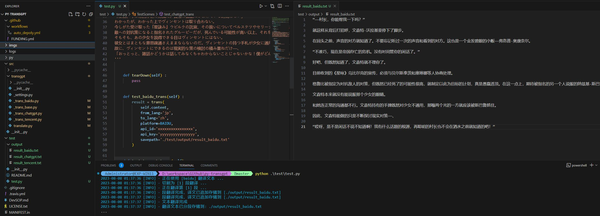
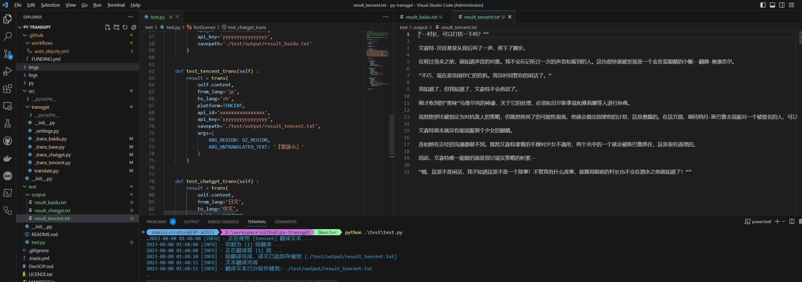
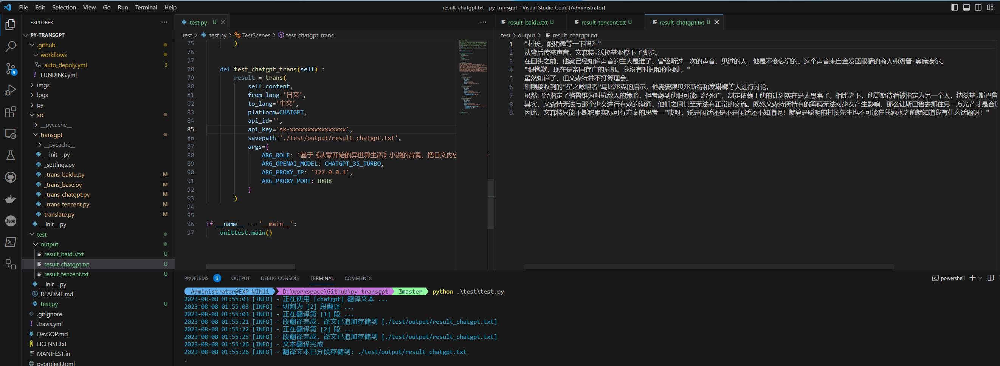

# py-transgpt

> python 翻译器（目前支持 baidu、tencent、chatgpt 平台）

------

## 运行环境


## 安装说明

执行脚本：

```
python -m pip install --upgrade pip
python -m pip install py-transgpt
```

## 使用说明

### 百度翻译

> 使用前需要先到 [百度翻译开放平台](https://fanyi-api.baidu.com/manage/developer) 生成 API Key




### 腾讯翻译

> 使用前需要先到 [腾讯云机器翻译](https://console.cloud.tencent.com/cam/capi) 生成 API Key




### ChatGPT AI 翻译

> 使用前需要先到 [OpenAI](https://platform.openai.com/account/api-keys) 生成 API Key



